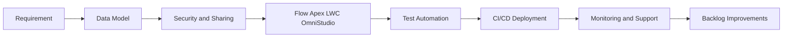
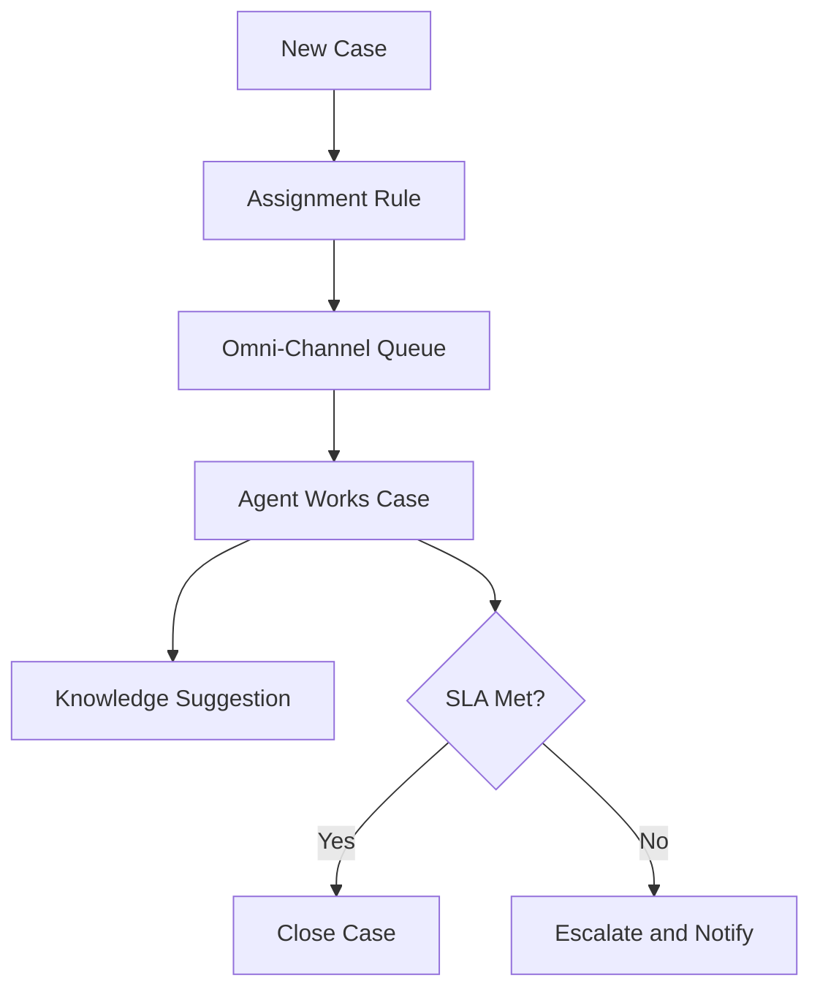
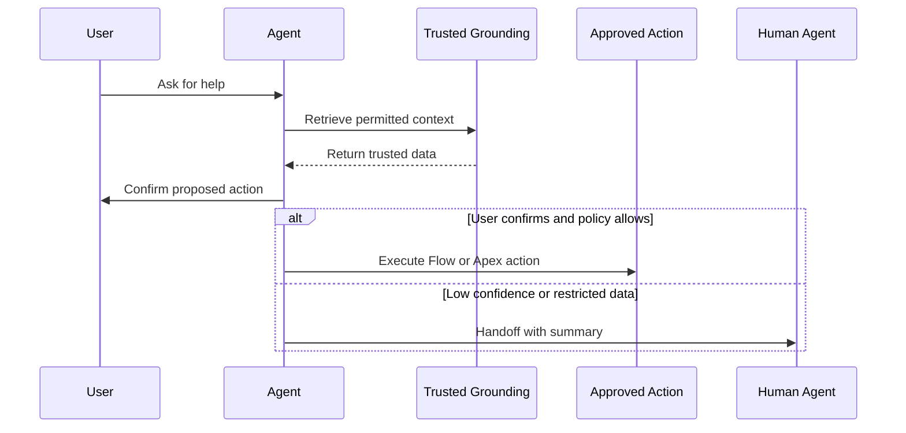

# Images and Flowcharts

These Mermaid diagrams render directly in GitHub Markdown.

## Salesforce Delivery Lifecycle

```mermaid
flowchart LR
  Req[Requirement] --> Model[Data Model]
  Model --> Sec[Security and Sharing]
  Sec --> Auto[Flow Apex LWC OmniStudio]
  Auto --> Test[Test Automation]
  Test --> Deploy[CI/CD Deployment]
  Deploy --> Monitor[Monitoring and Support]
  Monitor --> Improve[Backlog Improvements]
```

## Service Cloud Case Flow

```mermaid
flowchart TD
  Case[New Case] --> Assign[Assignment Rule]
  Assign --> Omni[Omni-Channel Queue]
  Omni --> Agent[Agent Works Case]
  Agent --> Knowledge[Knowledge Suggestion]
  Agent --> Milestone{SLA Met?}
  Milestone -->|Yes| Close[Close Case]
  Milestone -->|No| Escalate[Escalate and Notify]
```

## Agentforce Safe Action Pattern

```mermaid
sequenceDiagram
  participant User
  participant Agent
  participant Grounding as Trusted Grounding
  participant Action as Approved Action
  participant Human as Human Agent
  User->>Agent: Ask for help
  Agent->>Grounding: Retrieve permitted context
  Grounding-->>Agent: Return trusted data
  Agent->>User: Confirm proposed action
  alt User confirms and policy allows
    Agent->>Action: Execute Flow or Apex action
  else Low confidence or restricted data
    Agent->>Human: Handoff with summary
  end
```